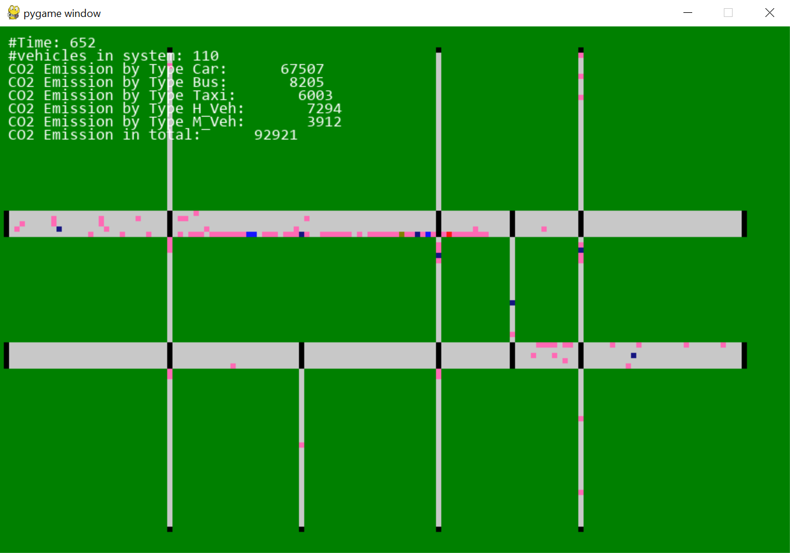

# GreenWaveSim
A discrete event traffic simulation for green-wave control



# Structure
- `main.py`: main entry of simulation
- `athens.py`: calibrations of properties (nodes, link, trafficLight and constants) in Athens. 
- `sim.py`: Implementation of the class`Simulation`, wrapping `simpy` and class `Network`.
- `net.py`: Implementation of the class `Network`, class `Link`, class `Node` and its inherited class `trafficLightNode`.
- `car.py`: Implementation of the class `Car`.
- `util.py`: A collection of helper functions.

# Requirement
```
python=3.9
pip install numpy
pip install simpy
pip install termcolor
pip install pygame
```